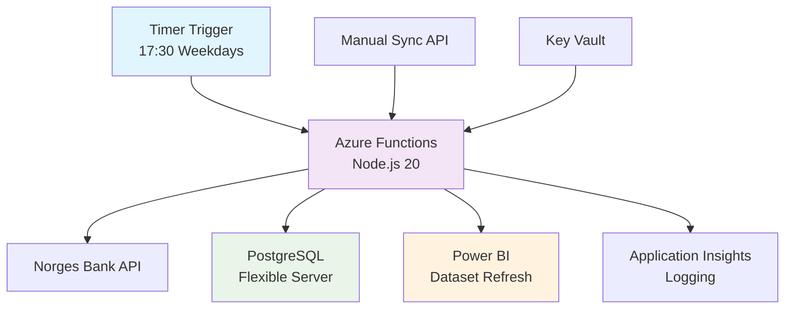

# 💰 finanseHub

*En komplett Azure-basert løsning for valutakurser og rentdata fra Norges Bank*

## 🌟 Overview

finanseHub er et automatisert backend-system som:
- 📊 Henter valutakurser og rentdata fra Norges Bank API
- 🗄️ Lagrer data i Azure PostgreSQL Flexible Server
- ⚡ Kjører på Azure Functions med timer-trigger (hverdager kl. 17:30)
- 📈 Integrerer med Power BI for automatisk dashboard-oppdatering
- 🔐 Bruker Azure Key Vault for sikker secrets-håndtering

## 🏗️ Arkitektur



## 🚀 Quick Start

### 1. Lokal oppsett
```bash
git clone <repository-url>
cd FinanseHub
./scripts/setup-local.sh
```

### 2. Deploy Azure-infrastruktur
```bash
./scripts/deploy-azure.sh
```

### 3. Konfigurer Power BI og deploy kode
```bash
# Opprett service principal og legg til secrets i Key Vault
# (se DEPLOYMENT.md for detaljer)

./scripts/deploy-functions.sh
```

## 📁 Prosjektstruktur

```
FinanseHub/
├── backend/                 # Azure Functions backend
│   ├── src/
│   │   ├── functions/       # Function endpoints
│   │   │   ├── timerSync.ts # Timer-trigger (17:30)
│   │   │   └── manualSync.ts# Manual sync API
│   │   └── lib/             # Core services
│   │       ├── norgesbank.ts# Norges Bank API client
│   │       ├── database.ts  # Database operations
│   │       ├── sync.ts      # Sync orchestration
│   │       ├── powerbi.ts   # Power BI integration
│   │       └── config.ts    # Configuration & Key Vault
│   ├── prisma/
│   │   └── schema.prisma    # Database schema
│   └── package.json
├── scripts/                 # Deployment scripts
│   ├── deploy-azure.sh      # Azure infrastructure
│   ├── deploy-functions.sh  # Function app deployment
│   ├── setup-local.sh       # Local development
│   └── build-and-test.sh    # Build & test
├── .github/                 # Documentation
└── DEPLOYMENT.md            # Comprehensive guide
```

## 🔧 Teknisk stack

- **Runtime**: Node.js 20 + TypeScript
- **Cloud**: Azure Functions (Consumption Plan)
- **Database**: Azure PostgreSQL Flexible Server + Prisma ORM
- **Secrets**: Azure Key Vault med RBAC
- **Monitoring**: Application Insights
- **BI**: Power BI integration med service principal
- **API**: Norges Bank REST API (CSV/JSON)

## 📊 Data modell

### Rate (Valutakurser)
```sql
CREATE TABLE "Rate" (
  id BIGSERIAL PRIMARY KEY,
  date DATE NOT NULL,
  base TEXT NOT NULL,        -- USD, EUR, GBP, etc.
  quote TEXT NOT NULL,       -- NOK
  value NUMERIC(18,8) NOT NULL,
  src TEXT DEFAULT 'NB',
  UNIQUE(date, base, quote)
);
```

### SeriesPoint (Renteserier)
```sql
CREATE TABLE "SeriesPoint" (
  id BIGSERIAL PRIMARY KEY,
  date DATE NOT NULL,
  series TEXT NOT NULL,      -- POLICY_RATE, NOWA, etc.
  label TEXT,                -- Tenor eller identifier
  value NUMERIC(18,8) NOT NULL,
  src TEXT DEFAULT 'NB',
  UNIQUE(date, series, label)
);
```

## ⚙️ Konfigurasjon

### Environment Variables
- `NB_BASES`: Valutaer å hente (standard: USD,EUR,GBP,SEK,DKK,JPY,ISK,AUD,NZD,IDR,CLP)
- `NB_QUOTE`: Målvaluta (standard: NOK)
- `NB_DEFAULT_START`: Start-dato for første sync (standard: 2023-01-01)
- `SYNC_MAX_ATTEMPTS`: Maks retry-forsøk (standard: 4)

### Key Vault Secrets
- `DATABASE-URL`: PostgreSQL connection string
- `CRON-KEY`: Sikkerhetsnøkkel for manual sync
- `PBI-*`: Power BI service principal config

## 🕐 Kjøreschema

- **Automatisk**: Hverdager kl. 17:30 CET (etter Norges Bank publiserer ~16:00)
- **Manuell**: POST `/api/manualSync` med `x-cron-key` header

## 📈 Monitoring

### Application Insights Queries
```kusto
// Sync-statistikk
traces
| where message contains "sync completed"
| order by timestamp desc

// Feilmeldinger
traces
| where severityLevel >= 3
| order by timestamp desc
```

### Health Check
```bash
curl -X POST 'https://finansehub-functions.azurewebsites.net/api/manualSync' \
     -H 'x-cron-key: YOUR_CRON_KEY'
```

## 🔒 Sikkerhet

- ✅ Managed Identity (ingen lagrede credentials)
- ✅ Key Vault RBAC for secrets
- ✅ CRON-key for manual sync API
- ✅ Database firewall regler
- ✅ HTTPS-only kommunikasjon

## 📚 Dokumentasjon

- [**DEPLOYMENT.md**](DEPLOYMENT.md) - Komplett deployment-guide
- [**Norges Bank API**](https://www.norges-bank.no/en/topics/Statistics/exchange_rates/) - API dokumentasjon
- [**Azure Functions**](https://docs.microsoft.com/azure/azure-functions/) - Platform dokumentasjon

## 🤝 Bidrag

1. Fork prosjektet
2. Lag feature branch (`git checkout -b feature/ny-funksjon`)
3. Commit endringer (`git commit -am 'Legg til ny funksjon'`)
4. Push til branch (`git push origin feature/ny-funksjon`)
5. Opprett Pull Request

## 📄 Lisens

Dette prosjektet er lisensiert under MIT License - se [LICENSE](LICENSE) filen for detaljer.

## 🎯 Roadmap

- [ ] Real-time webhook integrasjon
- [ ] Flere datakilder (ECB, Fed, etc.)
- [ ] GraphQL API for frontend
- [ ] Docker containerization
- [ ] Multi-region deployment

---

*Bygget med ❤️ for finansdata-entusiaster*
